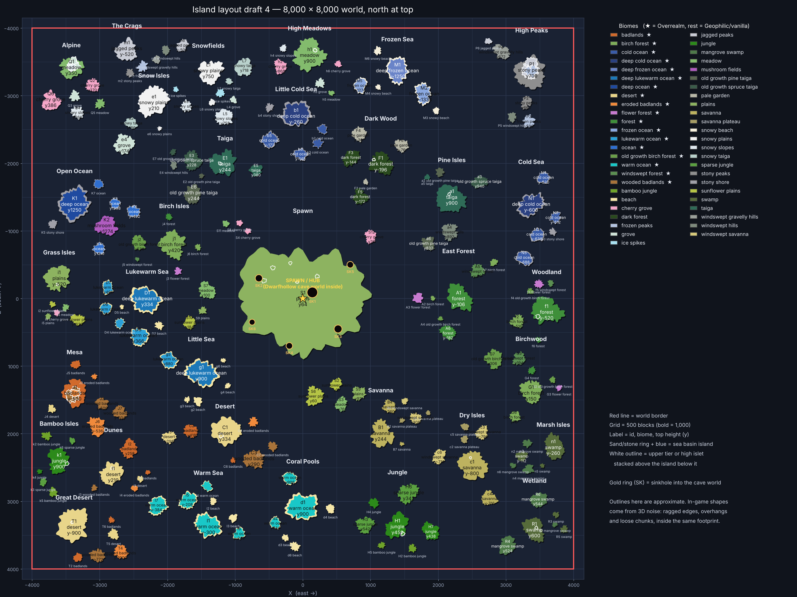

# The Isles

A hand-placed floating-island world for Minecraft Java **26.3**, built as a data pack (no mod needed).

- 8,000 × 8,000 world, full 4,064-block height (y −2032 to 2031)
- 240 islands in 33 groups, one biome per island, positions fixed by `layout/islands.json`
- Old-style floating island shapes: ragged rims, tapered undersides, loose chunks
- Stacked mountain tiers (High Peaks, Alpine, Mesa)



## Status

Prototype 0.1: terrain, biomes and ores. Tested in the game by `packtest/` (Minecraft 26.3 with Fabric API alone,
and with the Create mod pack it is made for); the test, its findings and what is still open are in
[`packtest/README.md`](packtest/README.md) and on the `ci-logs` branch.

| Done | Not yet |
|---|---|
| Island terrain from the layout | Water in the sea-basin islands (they generate as dry bowls) |
| One biome per island, tiers switch biome by height | Cave world inside the spawn island, and its sinkholes |
| Max world height | Cave systems and deepslate inside islands |
| Ores follow the surface of each island (depth instead of absolute height) | Surface rules that depend on fixed heights (badlands bands below y 63) |
| Rain or snow by biome, not by altitude | A way into the End (strongholds generate at the bottom of the world), oil deposits for Create Diesel Generators (no bedrock) |
| | Structures the game puts at fixed heights (trial chambers at y -40..-20, in rock, wherever an island's column is) |

## Using it

1. Run `python3 tools/build_pack.py`, or take the zip from a release.
2. Put the pack in the world's `datapacks` folder **before the world is first created**. It replaces the Overworld, so it cannot be added to an existing world.
3. With Create, Create Nuclear and Create: Gunsmithing, add `datapack-mods` (or its zip) the same way: their ores
   then follow the islands too. It does not load without those mods.
4. Biome packs (Geophilic, Overrealm) are **not** installed next to it: they are built in, see below.
5. Set a world border of 8,000 centred on 0, 0 and pre-generate inside it.

## Biome packs: Geophilic and Overrealm

The released zip has the vanilla biomes. Geophilic and Overrealm replace vanilla biome files; installed on top of
The Isles they would undo what it does to those files (the climate that keeps rain from turning into snow at
altitude) and bring features that pick fixed heights. So the generator takes their files and writes the final biomes
itself, into one pack:

1. Put the packs you downloaded into `vendor/` (zip or unpacked folder, any file name that contains the pack's name).
   `python3 tools/providers.py fetch` downloads the ones with a public address (Geophilic).
2. `python3 tools/build_pack.py` - it prints which pack every biome comes from and writes `build/the-isles.zip`
   (and `build/the-isles-mods.zip`, the same as `datapack-mods`).
3. Use `build/the-isles.zip` **instead of** the released zip, alone: it contains what it needs of the providers
   (their `geophilic:` / `orealm:` features, tags, templates). Do not also install Geophilic or Overrealm.

| Pack | What | Where | Licence |
|---|---|---|---|
| [Geophilic](https://modrinth.com/datapack/geophilic) 3.7, bebebea_loste | biome overhaul (31 vanilla biomes for 26.3) | Modrinth | All Rights Reserved |
| [Overrealm](https://www.patreon.com/posts/overrealm-data-148060790) 0.3.1, kanokarob | "Overworld Makeover" (18 vanilla biomes: forests, desert, badlands, oceans) | the author's Patreon | none in the pack; the author's terms for his packs forbid redistribution, also of modified parts |

Neither may be redistributed. That is why nothing of them is in this repository or in its releases: `vendor/` and
`build/` are ignored by git, and `build/the-isles.zip` is for your own worlds and servers only.

### Which pack a biome comes from

`layout/biome_sources.json`:

```json
{ "order": ["overrealm", "geophilic", "vanilla"], "biomes": {}, "drop_features": ["orealm:sequence/jellyfish"] }
```

For every vanilla biome of the layout the first pack of `order` that ships that biome for 26.3 is used; `vanilla`
always has it. With Overrealm 0.3.1 and Geophilic 3.7: Overrealm 17 biomes (91 islands), Geophilic 23 (122), vanilla 8
(27). Nothing has to be edited when a pack grows: Overrealm 0.3.1 has no `taiga`, so the six taiga islands are
Geophilic's; drop an Overrealm zip that has `data/minecraft/worldgen/biome/taiga.json` into `vendor/` (remove the
old one or keep it, the last by name wins), run `tools/build_pack.py`, and the table it prints shows `taiga` under
`overrealm`. To decide by hand: `"biomes": {"minecraft:taiga": "geophilic"}` (or `"vanilla"`). Swapping the first two
names of `order` prefers Geophilic wherever both have a biome. A build with other versions than the tested ones
(`layout/providers.json`) says so; it also lists anything of a pack it left out.

The choice is per biome, not per island: structures, the surface rule and biome tags go by the biome's id, so an
island cannot have its own variant of `minecraft:forest`. (The old `overrealm` column of the layout said which
islands have a biome that Overrealm ships; the build now works that out and prints it, the column is gone.)

What the build does to a provider's files, for any version:

* the biome file gets The Isles' climate and pinned colours like a vanilla one; its mob spawns, sounds and colours stay,
* placements that pick an absolute height (cave vegetation, cave disks, buried dungeons, springs: 63 in Overrealm
  0.3.1, none in Geophilic) become a depth under the island's surface - height `y` of a vanilla world is `64 - y`
  blocks down, at most 128 - and need rock within 16 blocks under them, so nothing is placed in the open under a
  thin island,
* what the game builds at the generator's sea level (icebergs; here the bottom of the world) and the features listed
  in `drop_features` (Overrealm's jellyfish, which float above a sea floor that has no water yet) are taken out,
* `eroded_badlands` islands use the pack's `badlands` (see the findings),
* files of a pack that The Isles has to own (dimension, noise settings, structures) are left out and listed.

The sea-basin islands are still dry (see the status table), so Overrealm's ocean floors generate without water:
corals, sponges, shelves and wrecks lie on a dry sea bed, kelp and sea grass do not grow.

## Editing the layout

`layout/islands.json` is the source of truth. Each island has a position, radius, top and bottom height, and biome. Change it, rerun `tools/build_pack.py`, and `tools/preview.py` draws a quick offline check (it uses stand-in noise, so shapes are only indicative).

## Layout of this repo

| Path | What |
|---|---|
| `layout/` | Island list, maps |
| `layout/providers.json`, `layout/biome_sources.json` | The biome packs the generator can use, and which pack each biome comes from |
| `tools/build_pack.py` | Generates `datapack/` and `datapack-mods/` from the layout, and `build/` with the biome packs of `vendor/` |
| `tools/providers.py` | Finds, downloads and reads the biome packs |
| `tools/preview.py` | Offline sanity check |
| `tools/vanilla_*` | Vanilla 26.3 data the generator starts from |
| `datapack/` | Generated pack (vanilla biomes), committed for convenience |
| `datapack-mods/` | Generated add-on for the mod pack (mod ores), committed for convenience |
| `packtest/` | In-game test on GitHub Actions |
